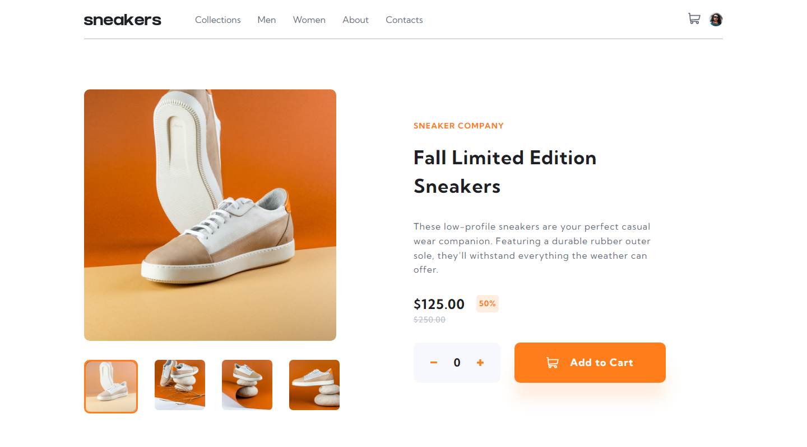

# Frontend Mentor - E-commerce product page solution

This is a solution to the [E-commerce product page challenge on Frontend Mentor](https://www.frontendmentor.io/challenges/ecommerce-product-page-UPsZ9MJp6). Frontend Mentor challenges help you improve your coding skills by building realistic projects.

## Table of contents

-  [Overview](#overview)
   -  [The challenge](#the-challenge)
   -  [Screenshot](#screenshot)
   -  [Links](#links)
-  [My process](#my-process)
   -  [Built with](#built-with)
   -  [What I learned](#what-i-learned)
   -  [Continued development](#continued-development)
   -  [Useful resources](#useful-resources)
-  [Author](#author)

## Overview

### The challenge

Users should be able to:

-  View the optimal layout for the site depending on their device's screen size
-  See hover states for all interactive elements on the page
-  Open a lightbox gallery by clicking on the large product image
-  Switch the large product image by clicking on the small thumbnail images
-  Add items to the cart
-  View the cart and remove items from it

### Screenshot



### Links

-  Solution URL: [Add solution URL here](https://github.com/jibreel1/e-commerce-page)
-  Live Site URL: [Add live site URL here](https://e-commerce-app-page.netlify.app)

## My process

### Built with

-  CSS custom properties
-  Flexbox
-  CSS Grid
-  Mobile-first workflow
-  Material UI
-  [React](https://reactjs.org/) - JS library

### What I learned

In this project, I learnt the basic concept of React and some css tricks

```css
.no-click-event {
   pointer-events: none;
}
```

### Continued development

I want to focus more on React because I find it very easy to use

### Useful resources

-  [w3schools](https://www.w3schools.com) - This website really helped me as a beginner. I have really improved, thanks to them.

-  [MDN](https://developer.mozilla.org/en-US/) - This website really helped improve my React.

## Author

-  Frontend Mentor - [@jibreel1](https://www.frontendmentor.io/profile/jibreel1)
-  Twitter - [@jibreel1005](https://www.twitter.com/jibreel1005)
